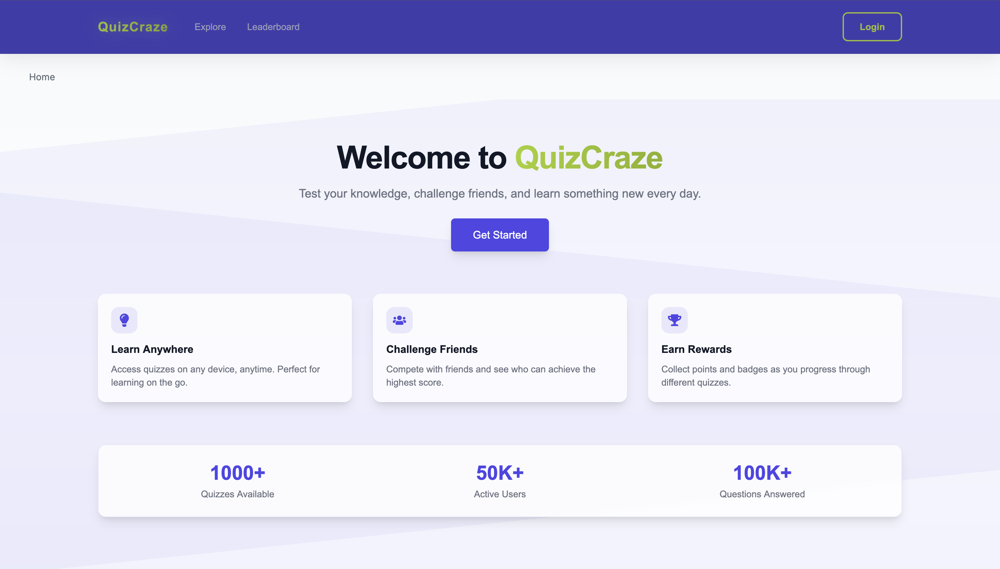
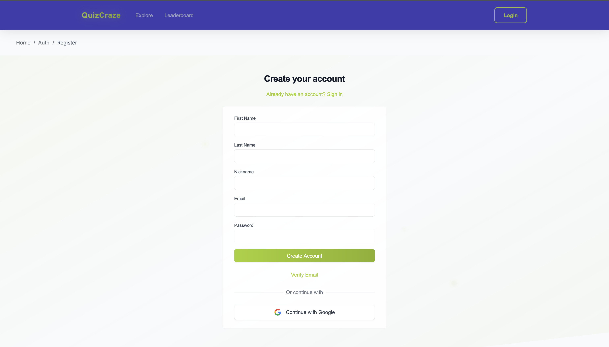
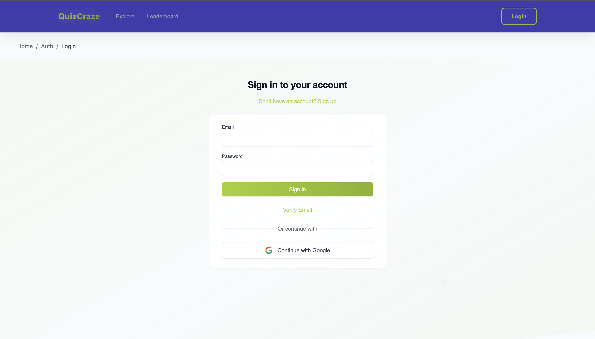
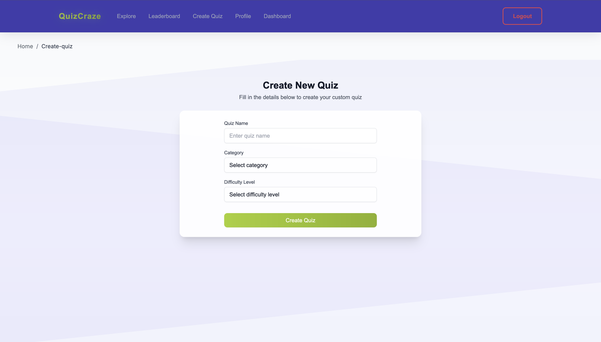
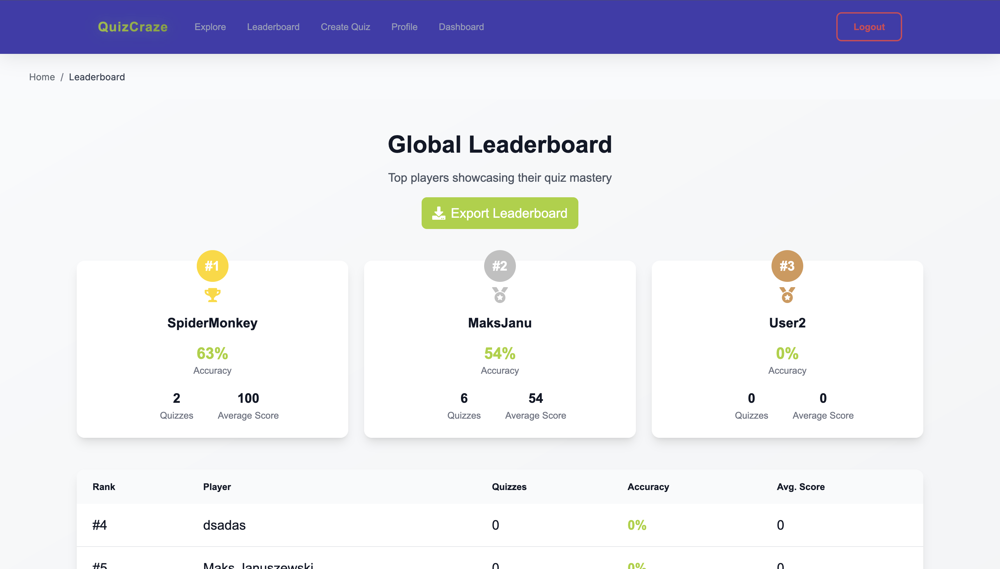
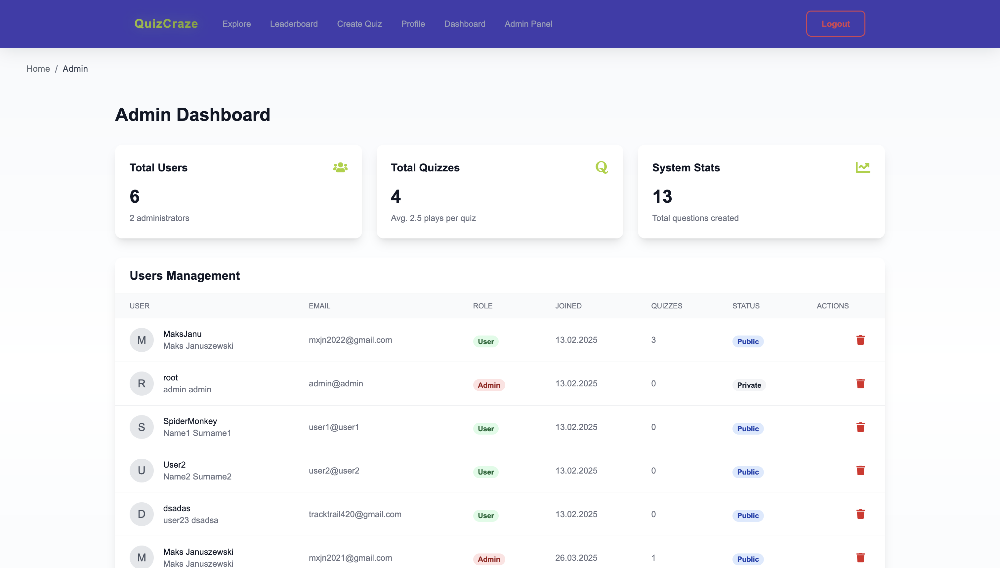
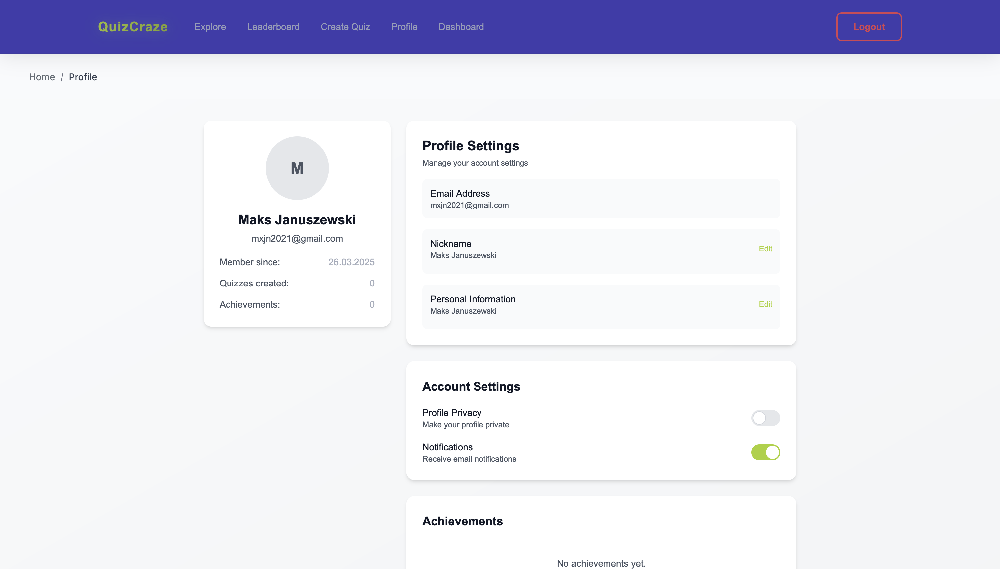

# QuizCraze

## Project Description

QuizCraze is an interactive quiz application that allows users to test their knowledge in various categories. The project was created to provide entertainment and education in a user-friendly environment. The application offers a single-player mode.

## Features

- **Creating and managing quizzes**: Users can create and manage their own quizzes.
- **Various question categories**: Aviation, F1, animals, and many more.
- **Game mode**:
  - Single-player mode.
- **Scoring and ranking system**: Track scores and compete with other players.
- **Responsive user interface**: Adapted for mobile and desktop devices.
- **Admin panel**: Manage content and users (for administrators).
- **User authentication**: Traditional login and registration using email and password with email verification via a code. There is also an option to log in using Google (OAuth2.0).

## Technologies

The project was developed using the following technologies:

- **Frontend**:
  - React.js: Building dynamic user interfaces.
  - Next.js: Framework for server-side rendering (SSR) and static site generation (SSG).
  - Tailwind CSS: Styling the application using utility-first tools.
- **Backend**:
  - Node.js: JavaScript runtime environment.
  - Express.js: Framework for building RESTful APIs.
  - MongoDB: NoSQL database for storing application data.
- **Others**:
  - DaisyUI: UI components based on Tailwind CSS.

## Project Structure

```
QuizCraze/
├── app/                # Main application components
│   ├── components/     # UI components (e.g., Navigation, Footer)
│   ├── explore/        # Views related to quizzes
│   ├── auth/           # Login and registration views
│   └── page.js         # Main application page
├── public/             # Static files (e.g., images, icons)
├── server/             # Application backend
│   ├── routes/         # API endpoints
│   ├── models/         # Data models (MongoDB)
│   └── server.js       # Main server file
├── styles/             # Tailwind CSS style files
├── tailwind.config.mjs # Tailwind CSS configuration
├── postcss.config.mjs  # PostCSS configuration
├── package.json        # Node.js configuration file
└── README.md           # Project documentation
```

## Screenshots

### Home Page


### Registration View


### Login View


### Quiz View


### Results View


### Admin Panel


### User Profile View


## Authors

- **MaksJanu** - [GitHub](https://github.com/MaksJanu)